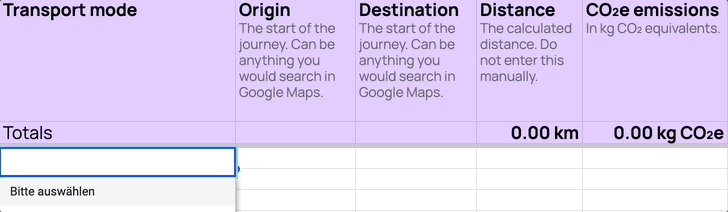

# Mobility Emissions Calculator

Welcome to the repository for the Mobility Emissions Calculator, a tool designed to streamline the process of dealing with mobility data for sustainability consultants.

## Description

The Mobility Emissions Calculator aids sustainability consultants in deducing CO₂e emission values from lists of origins, destinations, and modes of transportation. By simplifying these calculations, we hope to save valuable time that would otherwise be spent manually inputting data into platforms like Google Maps, followed by the application of the correct emissions factor.

## Getting Started

While this repository contains essential files, the primary tool is a Google Sheet. Access the template and make a copy for your use [here](https://docs.google.com/spreadsheets/d/1GFo8RTqikjabR9-5qQN69l2Vd1G4CcKc-3Fdl-SaSgo/template/preview).

## Usage

Here are some of the tasks you can perform with the Mobility Emissions Calculator:
* Calculate CO2 emissions from air travel using IATA codes for departure and arrival airports.
* Determine the emissions from train journeys.
* Compute emissions from personal car travels.

## Contributing

Developers are encouraged to contribute to the project. Please create a Pull Request with your changes, and after reviewing and merging, your contributions will be considered in future updates of the tool.

## Licensing

* Google Sheet Workbook: Licensed under a [Creative Commons Attribution-ShareAlike 4.0 International License](https://creativecommons.org/licenses/by-sa/4.0/).
* Attached Google App Scripts: Licensed under the [GNU General Public License (GPL) v3.0](https://www.gnu.org/licenses/gpl-3.0.en.html).

## Contact

If you have questions, feedback, or need assistance, please reach out through my [website](https://www.julianvogels.de).

Thank you for your interest in the Mobility Emissions Calculator!